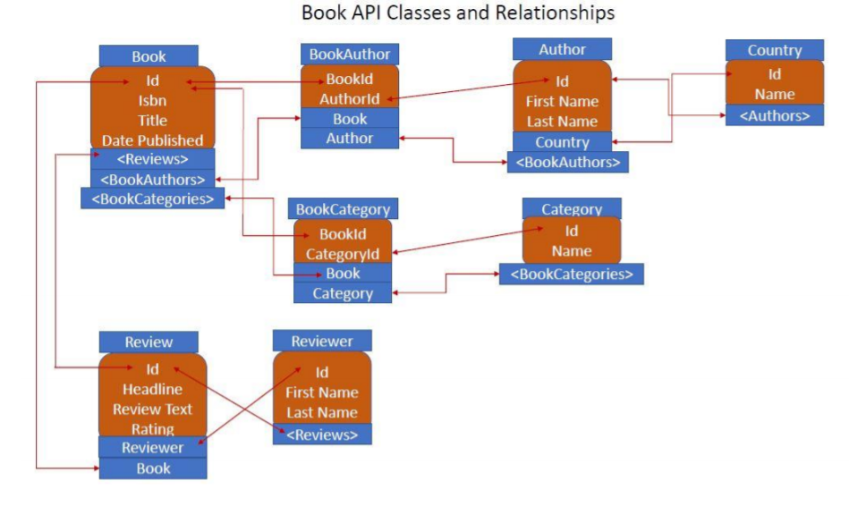

# BookApi Project
> WebApi_using_ASP.net_core for Book APIs

## Table of contents
* [General info](#general-info)
* [Screenshots](#screenshots)
* [Technologies](#technologies)
* [Setup](#setup)
* [Features](#features)

## General info
This project has 6 classes - 
    1. Book.cs
    2. Author.cs
    3. Review.cs
    4. Reviewer.cs
    5. Country.cs
    6. Category.cs
    
    The tables are:-
    Books, Authors, Categories, Reviews, Reviewers, BookAuthor and BookCategories are imtermediary tables
 
 It has the basic CRUD operations: GET, CREATE, UPDATE, DELETE

## Screenshots

## Technologies
* ASP.net core - version 2.1
* .Net Core  - version 2.1
* Microsoft Visual Studio Community 2019 - version 16.4.2
* DB Browser SQLlite - version 3.11.2

## Setup
Download the code in Visual Studio 2019. Seed the Database as below-
tools --> nuget package manger console
in Package manager console-
PM> add-migration IntialDatabaseCreation 

This created a class InitialDatabaseMigration.cs file. Now the tabels were ready to be inserted into database
Inside the InitialDatabaseMigration.cs, we have down method, 	it is used to invert the changes that we make.

PM> update-database

This will create the tables.

Now to insert the data:=
DbSeedingClass.cs is made as this class is never instantiated, so I made it static.
Here, I created an instance of BookAuthor tables .This table has reference to Books and Authors table.Authors table has reference to Country table. Books table have reference to BookCategory table, which then have reference to Category table. Books have also refrence to Review table, which has reference to Reviewer table.
Seeding the BookAuthors table will seed in all the tables in one shot.

Uncomment context.SeedDataContext(); in Configure method in startup.cs and run the project.
The tables will be populated. Now Comment context.SeedDataContext(); again.

The CRUD operations can be performed by running the code and using the URL with the path given above each controller in Postman or Curl as below-
the path for CreateBook api wil be as-
https://localhost:44335/api/books?authId=1&authId=2&catId=1&catId=2

Here-  path from /api/books?authId=1&authId=2&catId=1&catId=2 will be mentioned above each Controllers(Actions).

## Features
CRUD Operations can be done on Book, Author, Reviewer, Review, Country, Category APIs.

